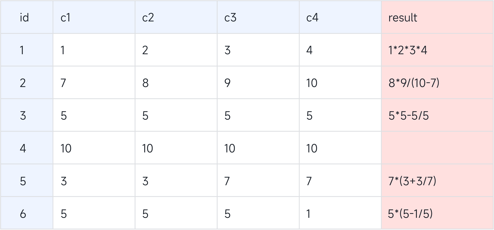

# 用一条 sql 计算 24 点的表达公式
https://www.ninedata.cloud/sql_poker24

有一张表 cards，id 是自增字段的数字主键，另外有4个字段 c1,c2,c3,c4 ，每个字段随机从 1~10 之间选择一个整数 要求选手使用一条 SQL 给出 24 点的计算公式，返回的内容示例如右图：

其中 result 字段是计算的表达式，只需返回1个解，如果没有解，result 返回 null

算法解析: 用一个 queue 中装满 4 个数后，随机从中选两个数计算结果之后再塞回 queue，一定次数之后，当 queue 仅剩的数为 24 则，计算公式成功，记得再这个过程中记录操作步骤，对操作符拼接的时候，记得记录操作符号的优先级。

sql 则使用 cte 先将统一行的 c1,c2,c3,c4 转成列，转列之后方便使用 sort 对其排列，比较容易想到的就是用 4 个 union 各自扫一列，然后用 group by unique id 使得统一行的数 group，然后使用 group concat 函数使得他们 sort 并 concat。这么做出来的 flatten_c1c2c3c4 可以用作 key 来打表。

因为 1-10 以内的四个随机数一共的组合方式也就 566 中，所以比较方便容易打表的方式来做。
