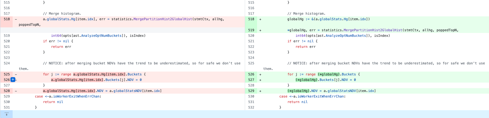

# Bounds Check Elimination
https://go101.org/article/bounds-check-elimination.html

最近来工作中发现了这个 pr：https://github.com/pingcap/tidb/pull/49997 主要是减少一些 BC 检查，增加 golang 运行时候的性能。主要背景是 golang 是 mem safe 安全语言，对于 slices，map 等都增加边界检查，防止访问不安全的领域。正如其所说：`Bounds checks make our code run safely, on the other hand, they also make our code run a little slower.` BC 能够使得 golang 运行的更加安全，但也会使得 golang 运行的更慢 (毕竟需要分心做一些边界检查)

# 示例

一个简单 case 来说，
```golang
// example1.go
package main

func f1(s []int) {
	_ = s[0] // line 5: bounds check
	_ = s[1] // line 6: bounds check
	_ = s[2] // line 7: bounds check
}

func f2(s []int) {
	_ = s[2] // line 11: bounds check
	_ = s[1] // line 12: bounds check eliminated!
	_ = s[0] // line 13: bounds check eliminated!
}

func f3(s []int, index int) {
	_ = s[index] // line 17: bounds check
	_ = s[index] // line 18: bounds check eliminated!
}

func f4(a [5]int) {
	_ = a[4] // line 22: bounds check eliminated!
}

func main() {}
```

`f1` 函数尽然需要 3 次边界检查，是因为在所传入的参数是递增的 0-2，在 f1 函数内部没有起到对后方 BC 的更多提示。相比 f2 如果 s[2] 的边界检查先做完，那么后续的 s[1] 和 s[0] 肯定都是可以通过的，所以 `f2` 内部对后续两部分进行 BCE 优化。

`f3` 函数的优化也是类似，index 是一个固定的参数传入，如果已经做过了 BC 那么函数后续位置可以减少这部分的工作。`f4` 函数也是类似的效果，引入参数是一个 fixed len 的数组，那么 a[4] 中的 4 已经被提示小于数组长度 5 的，那么这里的 BCE 也能做。

大致就是如果一些上下文逻辑，分析 BC 中的必然性，利用这部分的必然性来达到消除的效果。更的 case 可以 ref 原文中的更多 case。

# TiDB 示例


可以看到，原先的使用中 slice 中 Hg (统计信息的 histogram slices) 都是通过 idx 直接在用的地方多次通过下标 ref 使用，这里会产生多次的 BC。但是其实 idx 位置并没有变动，所以后续的 BC 是可以被消除掉的。根据 pr description 中的后续 check 仍在 L526 和 L527 位置出有 BC，我认为可能是其子元素 Buckets 中的遍历造成的。Hg 自己的 BEC 其实已经达到。